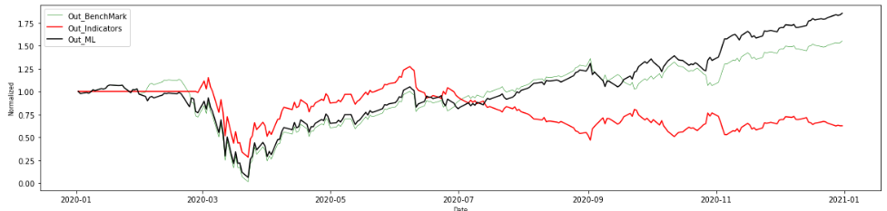

### Georgia Institute of Technology: Machine Learning for Trading

## Project: Develop a Trader with Machine Learning algorithms

# Stock Trading Simulation with Q-Learning Algorithm (Reinforcement Learning)

## Objective
To build a strategy learner that makes a trading decision (buy/sell/hold) for given period. 
The Result shall outperform the Benchmark for both in-sample period and out-sample period for the each stock ticker in a given set of stocks. 
The input of the learner shall be only Technical indicators, not fundamental indicatoras, and at least 3 of indicators shall be used.

## Requirements
- Python 3
- StrategyLearner.py
- ManualStrategy.py
- util.py
- indicators.py
- marketsimcode.py
- QLearner.py
- pandas, numpy, matplotlib, datetime

## Methodology
1. Learner
* Q-Learning(Reinforcement Learning) was chosen for a learner to train the model with a strategy that maximizes rewards.
2. Input for the Learner
* 3 Technical indicators, MACD, RSI, and BB%P, have been used because they reflect a different feature each: MACD indicates a trend, RSI indicates a momentum, and BB%P indicates a volatility. 
* Daily return of the stock has been used as a reward for the result of an action each day.
3. The learner is trained with the 3 technical indicators and a daily return and predict actions for given period with the relevant technical indicator values for the period.

## Result with the Final Model

## How to train and test(predict)
1. Train the Model
  symbol = Ticker of a stock to train (ex: "SPY")
  in_sd = start date of in-sample period (datetime format)
  in_ed = end date of in-sample period (datetime format)
  sv = starting value of the portfolio in dollars
  
  learner = sl.StrategyLearner(verbose = False, impact=impact)
  learner.add_evidence(symbol=symbol, sd=in_sd, ed=in_ed, sv=sv)
  
2. Predict daily actions (buy, sell, hold)
  symbol = Ticker of a stock to test (ex: "SPY")
  out_sd = start date of out-sample period
  out_ed = end date of out-sample period
  
  in_MLTrades = learner.testPolicy(symbol=symbol, sd=in_sd, ed=in_ed, sv=sv)
  out_MLTrades = learner.testPolicy(symbol=symbol, sd=out_sd, ed=out_ed, sv=sv)

3. Make a order table that contains only buy and sell actions
  in_MLTrades = toOrders(symbol=symbol, dailyTrades = in_MLTrades)
  out_MLTrades = toOrders(symbol=symbol, dailyTrades = out_MLTrades)
 
4. Compute daily portfolio values
  commission and impact are set as 0 at this time.
  
  in_ml1 = compute_portvals(in_MLTrades, start_date = in_sd, end_date = in_ed , start_val = sv, commission=commission, impact=impact)
  out_ml1 = compute_portvals(out_MLTrades, start_date = out_sd, end_date = out_ed , start_val = sv, commission=commission, impact=impact)

## Future Improvements
Here are few improvements that I could make it better

1. Decrease inconsistency in predictions. The result comes out differently depending on the training period or random actions in QLearner.
2. Better discretizing using sklearn.preprocessing. The result sometime outperforms benchmark but sometimes underperforms. 
